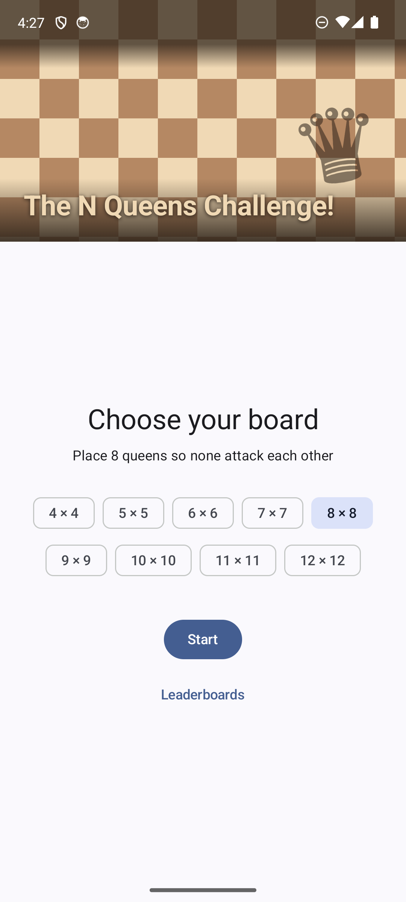
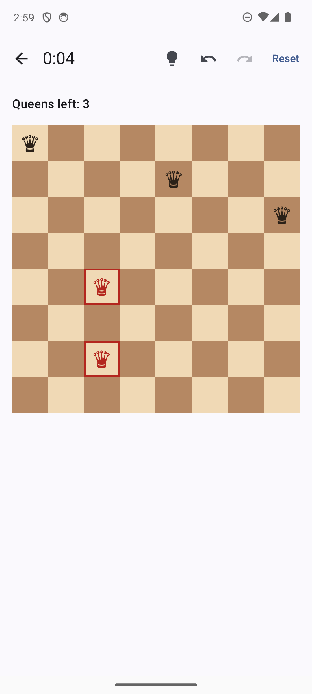
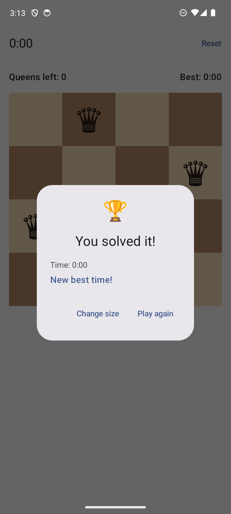

# The N Queens

A puzzle game for Android based on the N-Queens problem: place *n* queens on an *n×n*
chessboard so that no two queens threaten each other — no shared row, column, or
diagonal. Pick a board size, tap to place or remove queens, watch conflicts light up in
real time, and race your best time.

| Setup | Game (conflict highlighted) | Victory |
|---|---|---|
|  |  |  |

## Requirements

- Android Studio (latest stable) or a command-line Gradle setup
- Android SDK with API 37 (compileSdk 37, minSdk 30)
- JDK: provisioned automatically by the Gradle daemon toolchain (JDK 25 via Foojay)
- AGP 9.3.2, Kotlin 2.2.10 (AGP built-in Kotlin — no separate Kotlin Android plugin)

## Build, test, run

```bash
./gradlew :app:assembleDebug              # build the debug APK
./gradlew :app:testDebugUnitTest          # JVM unit tests (domain, data, ViewModel)
./gradlew :app:connectedDebugAndroidTest  # Compose UI tests (needs device/emulator)
./gradlew :app:installDebug               # install on a connected device
```

## Features

- Board sizes 4×4 through 12×12 (the rules support any n ≥ 4).
- Tap to place a queen, tap again to remove it.
- Real-time validation: every queen involved in a conflict is highlighted (red tint +
  red border — never color alone), not just the most recent one.
- Victory dialog when exactly *n* non-conflicting queens are placed.
- Queens-left counter, reset, elapsed timer, and per-size best times.
- Undo/redo through the full move history (places and removals). History lives in
  memory only: it survives rotation but not process death, and the clock keeps
  running — undoing moves never refunds time.
- Leaderboards screen with the top-3 times for every board size.
- Adaptive layout: portrait stacks the timer bar over the board; wide windows
  (landscape phones, tablets, desktop) switch to a two-pane screen with the board
  beside a stats panel.
- Backing out of a run asks for confirmation first, with the clock paused while you
  decide.
- Spring animation on queen placement/removal and a restrained victory celebration.
- Sound effects for queen placement, conflicts, and victory (synthesized in-repo, no
  licensed assets).
- In-progress games survive rotation and process death.
- Every board cell exposes semantics (`Row 2, column 4, queen, conflicting`) for
  TalkBack and UI tests.

## Architecture

Single-module app with a deliberate, lean layering — MVI-lite:

```text
Compose UI ── renders state, sends GameAction ──▶ GameViewModel
                                                     │
                    ┌────────────────┬───────────────┤
                    ▼                ▼               ▼
              NQueensRules       GameClock     BestTimeRepository
              (pure Kotlin)    (fun interface)  (DataStore impl)
```

- **One immutable `GameUiState`** in a `StateFlow` is the single source of truth for the
  game screen; **one sealed `GameAction`** hierarchy enters through a single
  `onAction()` — unidirectional data flow without a reducer framework.
- **`domain/`** is pure Kotlin (no Android/Compose/coroutines imports): `NQueensRules`
  detects conflicts by pairwise comparison (O(q²) — chosen for clarity; a count-based
  O(q) version is a documented optimization, unjustified at n ≤ 12) and decides
  solved-ness. Fully unit-tested, including known solutions for n = 4, 5, 8.
- **`data/`** hides side effects behind two tiny interfaces: `GameClock` (monotonic
  time) and `BestTimeRepository` (DataStore Preferences, top-3 times per board size,
  with transparent migration from the earlier single-best format). ViewModel tests use
  hand-written fakes — no mocking framework.
- **`ui/`** renders state and emits actions; composables contain no game logic. The
  board is regular Compose cells (not Canvas) so every cell is accessible and
  addressable in tests. Victory is *derived* from `status == SOLVED`, shown as a
  dialog over the preserved board. One-off events (sounds) flow through a
  `SharedFlow<GameEffect>` with no replay — durable facts live in state, moments live
  in effects.
- **DI is Hilt** (Dagger): `@HiltViewModel` + one module providing the clock and
  DataStore-backed repository.
- **Navigation Compose with type-safe routes**: `@Serializable` route classes
  (`SetupRoute`, `GameRoute(boardSize)`, `LeaderboardRoute`) instead of string
  patterns; the board size lands in `SavedStateHandle` under its property name.

### Package map

```text
com.hdlp.thenqueens
├── di/          Hilt modules (clock, DataStore, repository binding)
├── domain/      BoardPosition, GameStatus, NQueensRules  (pure Kotlin)
├── data/        GameClock, BestTimeRepository, DataStore implementation
└── ui/
    ├── setup/       board-size selection with the chess hero header
    ├── game/        GameUiState, GameAction, GameEffect, GameViewModel, GameScreen,
    │                Board, SoundEffects
    ├── leaderboard/ LeaderboardViewModel, LeaderboardScreen
    └── victory/     VictoryDialog
```

## Key decisions and assumptions

- At most *n* queens can be placed; at the limit, taps on empty cells are ignored while
  removal still works.
- All conflict participants are highlighted, not only the latest queen.
- The timer starts on the first move, stops on victory, resets with the game, and
  **includes time spent with the app backgrounded** (it is a real-time clock, measured
  with `elapsedRealtime` from a start timestamp — the display ticker is not the source
  of truth). The one deliberate exception: pressing back mid-run pauses the clock
  behind the give-up confirmation, and declining resumes with the paused span excluded.
- The top three times are kept per board size, sorted fastest-first; a result is
  recorded only when it enters that top three.
- Restoration: board, status, and timing reference are saved through
  `SavedStateHandle`. A device reboot between process death and restore resets the tick
  baseline (elapsed time is clamped, never negative).
- The UI offers presets 4–12 to keep touch targets usable; the domain has no upper
  bound.
- Adaptivity is centralized in a small design system (`ui/theme`): hand-rolled window
  size classes using Material's canonical breakpoints (600/840 dp widths), a `Dimens`
  token set (spacing scale, content max-width, header cap) selected per width class,
  and typography that scales up ~15% on expanded widths. Windows with a compact height
  fall back to the phone treatment (`tokenWidthClass`), so landscape phones keep
  compact spacing and type. Screens read `NQueensTheme.dimens` instead of hardcoding
  dp values. No adaptive library was added — the breakpoint values stay owned by this
  codebase and trivially explainable.

## Testing strategy

| Suite | What it covers | Run with |
|---|---|---|
| `domain` (15 tests) | Every conflict axis, multi-queen conflicts return all participants, symmetry/translation properties, known solutions for n = 4, 5, 8, not-solved cases | `testDebugUnitTest` |
| `data` (6 tests) | DataStore repository: first save, improvement-only recording, per-size isolation, top-3 trimming on write and read, legacy single-best migration | `testDebugUnitTest` |
| ViewModels (29 tests) | Place/remove/limit, conflict recalculation, timer start/tick/pause/resume/reset, solved-exactly-once, best-time save, sound-effect emissions, SavedStateHandle round-trips, leaderboard entries | `testDebugUnitTest` |
| design system (10 tests) | Window size classes, dimension tokens, type scaling, elapsed-time formatting | `testDebugUnitTest` |
| UI journeys (5 tests) | Select size → board renders; conflicts marked; reset clears; leaderboard opens and returns; solve 4×4 → victory dialog | `connectedDebugAndroidTest` |

UI tests validate wiring and semantics only — domain behavior is not re-tested through
the UI.
